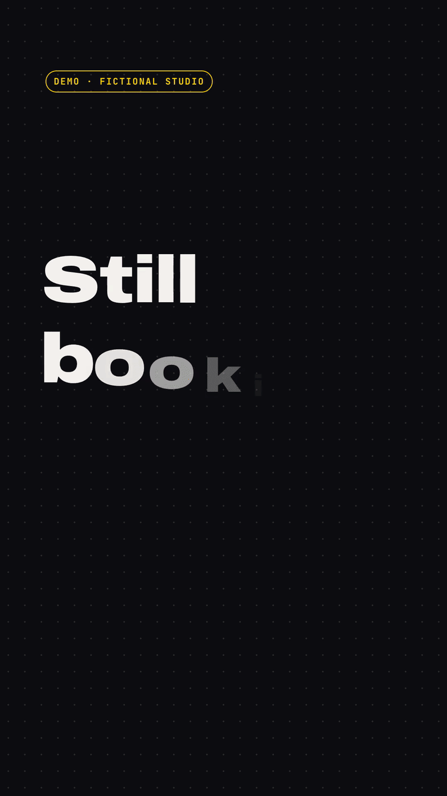
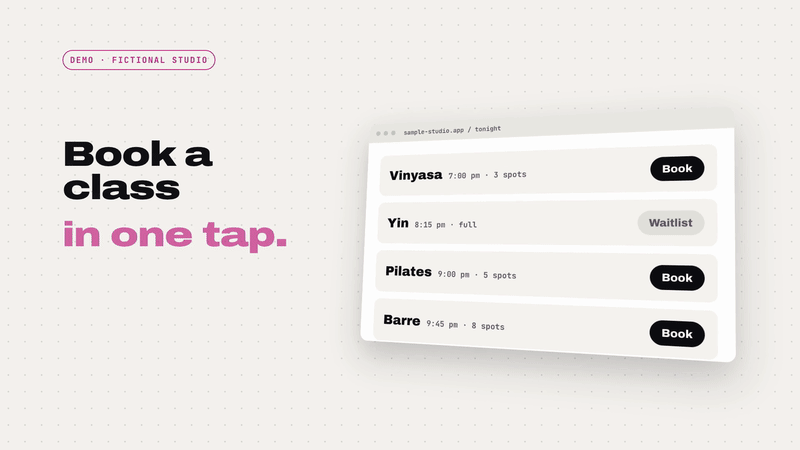
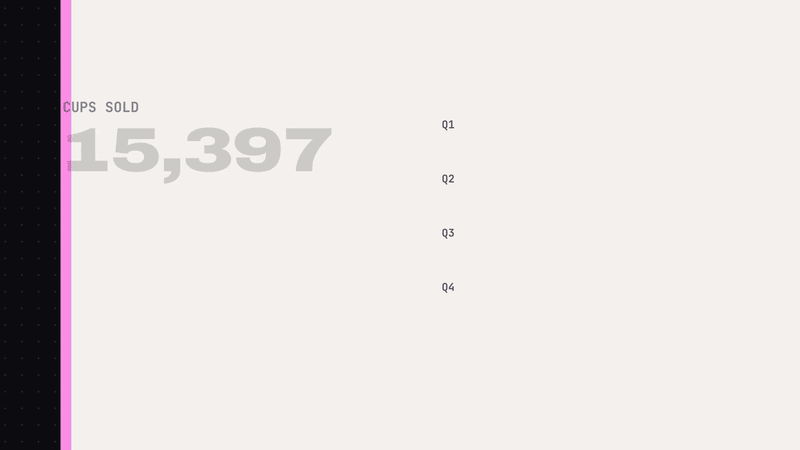
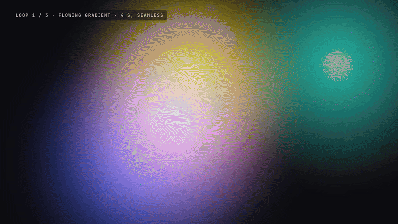
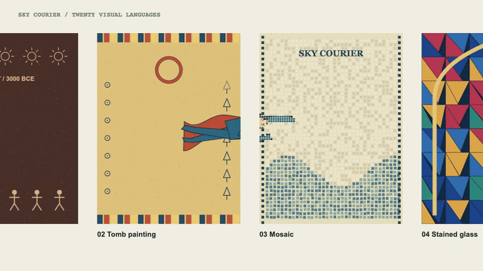
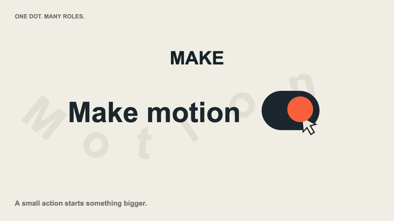
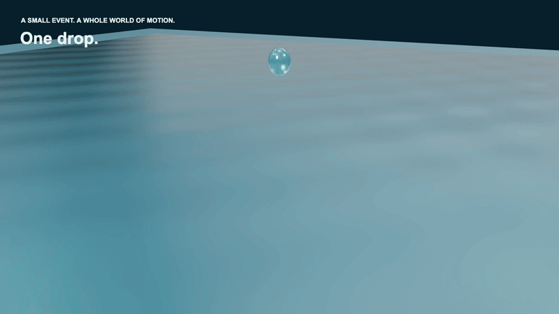

# Motion FX Lab

**Make editable motion graphics and export them to MP4:** social clips, product demos, infographics, animated titles, backgrounds and character sequences. Choose a use-case example or finished sequence, then adapt its copy, data or motion. Start with the 12 selected films; the intro and nine supporting studies remain available separately. The effect library contains 70 families, 22 selectable variants and 5 combined showcases. Every exported frame is rendered twice and compared before delivery.

[](media/intro.mp4?v=signal-1)

▶ **[Full intro video, with sound](media/intro.mp4?v=signal-1)** (55 s, rendered by this repo) · **[Live gallery](https://howardc38.github.io/motion-fx-lab/)** · **Licence: [0BSD](LICENSE)**, no conditions · No build step · No AI-generated images or sound

GitHub does not play video files from a repository inline, so the loop above is a GIF. The gallery plays the real video.

## What it is for

Describe the video to an AI coding assistant, or write it yourself. It becomes a web page, and this repo renders it to MP4, frame by frame. No AI-generated pictures or sound, so every word and number is exact and every frame can be edited.

<table>
<tr>
<td width="50%"><a href="media/reel.mp4"></a><br><b>Social clips.</b> 9:16, 4:5 or 16:9. <a href="media/reel.mp4">12 s video</a> · <a href="examples/reel.html">source</a></td>
<td width="50%"><a href="media/product.mp4"></a><br><b>Product demos.</b> Your screen, a cursor, a tap. <a href="media/product.mp4">7 s video</a> · <a href="examples/product.html">source</a></td>
</tr>
<tr>
<td><a href="media/infographic.mp4"></a><br><b>Infographics.</b> Charts drawn from your numbers. <a href="media/infographic.mp4">14 s video</a> · <a href="examples/infographic.html">source</a></td>
<td><a href="media/broll.mp4"></a><br><b>B-roll.</b> Background loops with no seam. <a href="media/broll.mp4">12 s video</a> · <a href="examples/broll.html">source</a></td>
</tr>
</table>

Plus characters drawn in code and 70 reusable effect techniques. The 55-second intro moves from four uses and character action into three stories: One Flight, Twenty Worlds; One Word, Many Forms; and One Push, Chain Reaction. It closes by changing text, scrubbing the timeline and exporting MP4. Use the viewing guide below to choose a starting point. The four use-case examples keep their editable text or numbers near the top of their HTML files; change them and run `bash video/build.sh examples/reel.html` for a new MP4. The studio and the shop are fictional, and the numbers are sample data.

## Finished sequences and single effects

The website starts with three levels:

- **Use-case examples:** the four GIFs above show familiar video formats you can adapt.
- **Finished sequences:** the three featured films below combine motion, visual treatments, editing and sound around one subject.
- **Single-effect library:** 70 reusable operations, with variants inside their family cards. Use these building blocks in your own films.

The **Choose from 12 selected films** shortlist groups five sequences, four
use-case templates, one comparison and two single-effect films. The intro stays
at the top of the page. Nine supporting studies are reached through related effect
cards or the source archive below, rather than repeated in the main film list.
The three featured choices cover art direction, connected graphic motion and
materials. See the [viewing and effect-family guide](fx/VIEWING-GUIDE.md).

<table><tr>
<td width="33%"><a href="media/style-journey.mp4"></a><br><b>One flight. Twenty worlds.</b><br>One character, continuous motion, twenty art directions.</td>
<td width="33%"><a href="media/dot-story.mp4"></a><br><b>One dot. Many roles.</b><br>One orange dot becomes a switch, a letter, a spring trace and a reveal before returning to the start.</td>
<td width="33%"><a href="media/water-forms.mp4"></a><br><b>One drop. Many forms.</b><br>A drop, splash, changing glass forms and an underwater closing scene.</td>
</tr></table>

Social and Product share a fictional booking app but show different video formats.
COUNTERFORM and Eight Treatments share choreography: one is a finished action
sequence, the other compares operations on that action. The three Blender films
are single-effect renders linked from their effect cards. All 22 video bundles and their GIF previews remain in the repository. The
shortlist below contains 12; its collapsed source archive contains the other ten.

Three effect families cover **3D spatial type, source-size soft shadows and light-responsive surface hatching**. Letter reflow, a spring-response graph and a radial dot reveal are variants of existing type, timing and wipe families. The dot and city sequences combine these operations; the shadow film isolates one. They reuse Three.js, Canvas and GLSL—no new runtime dependency. See the [design-film editing guide](fx/design/README.md).

## Published films and previews

### Finished sequences · 5

Complete subjects with a beginning, development and closing beat. Effects and motion are reused across these films.

| Type | Film | Authored length | Format | Preview | Source |
|---|---|---:|---|---|---|
| Sequence | [One flight. Twenty worlds.](media/style-journey.mp4) | 40.8 s | 16:9 | [GIF](media/style-journey.gif) · [poster](media/style-journey.jpg) | [HTML](examples/style-journey.html) |
| Sequence | [One dot. Many roles.](media/dot-story.mp4) | 19.2 s | 16:9 | [GIF](media/dot-story.gif) · [poster](media/dot-story.jpg) | [HTML](examples/dot-story.html) |
| Sequence | [One drop. Many forms.](media/water-forms.mp4) | 21.6 s | 16:9 | [GIF](media/water-forms.gif) · [poster](media/water-forms.jpg) | [HTML](examples/water-forms.html) |
| Sequence | [One word. Many forms.](media/word-forms.mp4) | 21.6 s | 16:9 | [GIF](media/word-forms.gif) · [poster](media/word-forms.jpg) | [HTML](examples/word-forms.html) |
| Sequence | [COUNTERFORM](media/dot-battle.mp4) | 19.2 s | 16:9 | [GIF](media/dot-battle.gif) · [poster](media/dot-battle.jpg) | [HTML](examples/dot-battle.html) |

### Use-case templates · 4

Start here for a social ad, interface walkthrough, data story or reusable background.

| Type | Film | Authored length | Format | Preview | Source |
|---|---|---:|---|---|---|
| Use case | [Social clips](media/reel.mp4) | 12 s | 9:16 | [GIF](media/reel.gif) · [poster](media/reel.jpg) | [HTML](examples/reel.html) |
| Use case | [Product demos](media/product.mp4) | 7.2 s | 16:9 | [GIF](media/product.gif) · [poster](media/product.jpg) | [HTML](examples/product.html) |
| Use case | [Infographics](media/infographic.mp4) | 14.4 s | 16:9 | [GIF](media/infographic.gif) · [poster](media/infographic.jpg) | [HTML](examples/infographic.html) |
| Use case | [Animated backgrounds](media/broll.mp4) | 12 s | 16:9 | [GIF](media/broll.gif) · [poster](media/broll.jpg) | [HTML](examples/broll.html) |

### Effect comparison · 1

Compare eight operations against the same choreography.

| Type | Film | Authored length | Format | Preview | Source |
|---|---|---:|---|---|---|
| Comparison | [Same fight. Eight treatments.](media/fight-effects.mp4) | 38.4 s | 16:9 | [GIF](media/fight-effects.gif) · [poster](media/fight-effects.jpg) | [HTML](examples/fight-effects.html) |

### Single-effect films · 2

Longer exports for inspecting a specific material, lighting or simulation behaviour.

| Type | Film | Authored length | Format | Preview | Source |
|---|---|---:|---|---|---|
| Single-effect render | [Find the Form](media/fluid-smoke.mp4) | 9.6 s | 16:9 | [GIF](media/fluid-smoke.gif) · [poster](media/fluid-smoke.jpg) | [HTML](examples/fluid-smoke.html) |
| Single-effect render | [Overflow](media/fluid-overflow.mp4?v=liquid-v2) | 9.6 s | 16:9 | [GIF](media/fluid-overflow.gif?v=liquid-v2) · [poster](media/fluid-overflow.jpg?v=liquid-v2) | [HTML](examples/fluid-overflow.html?v=liquid-v2) |

<details>
<summary>Supporting studies and intro — source archive (10 bundles)</summary>

The intro is already shown above. Ink City and Shadow Lab are linked from surface
hatching and soft shadows. The optical and three-operation samplers belong to
related effect cards; the room comparison belongs to its combined-scene preset.
Slow Gold is retained as an archived material study pending visual refinement. The three signal-driven studies below connect actual audio features to solid relief, actual image movement to emitted fragments, and music attacks to a held 3D impact.

| Type | Film | Authored length | Format | Preview | Source |
|---|---|---:|---|---|---|
| Overview | [Intro](media/intro.mp4?v=signal-1) | 55.2 s | 16:9 | [GIF](media/intro.gif?v=signal-1) · [poster](media/intro.jpg?v=signal-1) | [HTML](video/intro.html) |
| Sequence | [One block. A drawn city.](media/ink-city.mp4) | 19.2 s | 16:9 | [GIF](media/ink-city.gif) · [poster](media/ink-city.jpg) | [HTML](examples/ink-city.html) |
| Single-effect render | [One light. Different edges.](media/shadow-lab.mp4) | 9.6 s | 16:9 | [GIF](media/shadow-lab.gif) · [poster](media/shadow-lab.jpg) | [HTML](examples/shadow-lab.html) |
| Comparison | [Six optical treatments](media/optical.mp4) | 18 s | 16:9 | [GIF](media/optical.gif) · [poster](media/optical.jpg) | [HTML](examples/optical.html) |
| Comparison | [Image distortion, collisions and particles](media/stacks.mp4) | 24 s | 16:9 | [GIF](media/stacks.gif) · [poster](media/stacks.jpg) | [HTML](examples/stacks.html) |
| Comparison | [One scene. Many eras.](media/scene-eras.mp4) | 24 s | 16:9 | [GIF](media/scene-eras.gif) · [poster](media/scene-eras.jpg) | [HTML](examples/scene-eras.html) |
| Single-effect render | [Slow Gold](media/fluid-viscous.mp4?v=liquid-v2) | 9.6 s | 16:9 | [GIF](media/fluid-viscous.gif?v=liquid-v2) · [poster](media/fluid-viscous.jpg?v=liquid-v2) | [HTML](examples/fluid-viscous.html?v=liquid-v2) |
| Signal-driven study | [Pulse / Form](media/audio-relief.mp4) | 12 s | 16:9 | [GIF](media/audio-relief.gif) · [poster](media/audio-relief.jpg) | [HTML](examples/audio-relief.html) |
| Signal-driven study | [Motion / Release](media/motion-fragments.mp4) | 12 s | 16:9 | [GIF](media/motion-fragments.gif) · [poster](media/motion-fragments.jpg) | [HTML](examples/motion-fragments.html) |
| Signal-driven study | [Impact / Orbit](media/impact-orbit.mp4) | 12 s | 16:9 | [GIF](media/impact-orbit.gif) · [poster](media/impact-orbit.jpg) | [HTML](examples/impact-orbit.html) |

</details>

All 22 retained video bundles have animated GIF previews and still posters. A GIF
is a silent selection of shots, not the full film. MP4 container durations can be
about 0.1 s longer than the authored timeline because of the final frame and
encoding timestamps. `assets/studio/fight-source.mp4` is a silent green-screen
source asset, not another finished film.

```sh
npm run build:all       # all 22 retained video bundles
npm run build:showcase  # intro, optical, stacks, studio, material, design, signal and baked-fluid films
npm run render:design-films # dot story, ink city and soft-shadow study
npm run render:signal-films # measured audio relief, motion fragments and impact orbit
npm run test:media      # source dimensions/duration and MP4/poster/GIF bundle checks
```

An appearance change to a shared renderer requires rebuilding its dependent
films and previews. In particular, the intro embeds gallery adapters; the
fight-effects comparison uses the shared studio effects. Run
`npm run build:studio-assets` first when changing the shared fight choreography
or the 3D model, then rebuild the dependent film bundles. Review actual moving
pictures as well as tests: different metadata or pixels do not by themselves
prove a useful or well-directed effect.

## Intro storyboard

| Time | Story |
|---|---|
| 0–2.4 s | Motion graphics in plain HTML |
| 2.4–16.8 s | Social clips, product demos, infographics and B-roll; 3.6 s each |
| 16.8–21.6 s | A character hands over information; an impact freezes while camera and lighting keep moving |
| 21.6–26.4 s | Audio-driven solid relief, motion-driven fragments, spatial type and volumetric smoke |
| 26.4–33.6 s | One Flight, Twenty Worlds: six readable styles, then the twenty-style overview |
| 33.6–40.8 s | One Word, Many Forms: 流動 → solid lettering → particles → contour lines → signal breakup → 流動 |
| 40.8–45.6 s | One Push, Chain Reaction: follow the fall, then reveal all 48 dominoes |
| 45.6–50.4 s | Scrub time, change WAVE to FLOW and export MP4 |
| 50.4–55.2 s | Repository and licence CTA |

These three intro stories combine existing capabilities; they do not add three
new effect registrations. Source: [intro.html](video/intro.html) and
[intro-stories.js](fx/intro-stories.js).

## Sound familiar?

- **Changing one word means another export.** Your motion graphics live in a desktop app. You cannot diff them, review them in a pull request or render ten variants from a script.
- **Some alternatives use React and eligibility-based licensing.** Remotion uses React; its [licence](https://github.com/remotion-dev/remotion/blob/main/packages/core/LICENSE.md) offers free use for eligible individuals, small for-profit organizations and nonprofits, with a Company License for others.
- **Headless Chrome renders your 3D on a CPU.** By default Playwright's headless Chromium runs WebGL on SwiftShader, a software GPU. On our test scene that was 99.8 ms a frame instead of 4.0 ms on the real GPU.
- **Browser capture fails silently.** A lost WebGL context screenshots as a blank frame, with no error. Parallel browsers can disagree too: after a scale animation, one of ours kept laying out SVG labels at 0.6 of their size. A spot check of 8 frames missed that; we only caught it by comparing whole renders.
- **Colours shift in the browser.** Converting screenshots to video with ffmpeg's defaults uses the BT.601 matrix and writes no colour tags, and browsers read untagged HD video as BT.709. Our pink `#ff90e8` played back as `#ff9fe8`.
- **The upload comes out quiet, or gets rejected.** Our first mix measured −21 LUFS, far quieter than the −14 LUFS convention, and used AAC at 160 kbps, over Meta's 128 kbps limit for Reels. ffmpeg's `loudnorm` silently switched to dynamic compression when a linear gain would clip.
- **Chinese, Japanese and Korean text break common effects.** Small Latin-only 3D fonts cannot render CJK, and halftone or glitch effects can wipe out dense strokes. This repo now includes a separate CJK outline subset for solid type.

## What you get

| Pain | What this repo does |
|---|---|
| Hand-built, un-diffable animation | Every timeline effect is a small function of time in a plain web page. Serve the gallery over localhost; no framework or bundler. |
| Starting from a blank page | 70 effect techniques you can copy: kinetic type, UI mock-ups, charts, generative patterns, ray-marched and GPU-particle shaders, physics simulations, chrome, and toon, flat and dithered characters. |
| Slow 3D in headless Chrome | GPU rendering through ANGLE Metal, lossless CDP screenshots and 4 browsers in parallel: **399.6 s → 52.9 s** for a 56-second, 3D-heavy video, including the second render that verifies it. |
| Silent wrong frames | The whole video is rendered twice, each frame on a different browser, and every frame is compared. The recorder also stops on a CPU fallback, a lost WebGL context, a page error or a font that did not load. |
| Colour shifts | Screenshots are converted with the BT.709 matrix and every file is tagged BT.709; the checks refuse an untagged file. |
| Quiet or rejected uploads | Audio is limited, then brought to −14 LUFS by a linear gain, and its loudness and true peak are measured on the final file. AAC encoding can lift the true peak (by up to 0.7 dB on our videos), so the encoded audio is measured and mastered again lower if it would pass −1 dBTP. Video and audio are checked against Meta's Reels limits. |
| CJK text | Canvas-sampled particles use available fonts. The solid CJK variant uses bundled vector outlines, also shared by its particle and contour treatments; unsupported glyphs report how to rebuild the subset. |
| Licence worries | Code under 0BSD: use it for anything, no attribution needed. Music and sound effects are synthesised in code, so there is no sample to license. |

## Quick start

```sh
git clone https://github.com/howardc38/motion-fx-lab.git
cd motion-fx-lab
npm install
npx playwright install chromium
bash video/build.sh video/intro.html    # writes media/intro.mp4, intro_hq.mp4, intro.jpg and intro.gif
bash video/build.sh examples/reel.html  # any example, or a page of your own
python3 -m http.server 8000              # optional gallery preview: http://localhost:8000/
```

Rendering needs macOS on Apple silicon for the GPU path, plus Node, Python 3 (standard library only) and ffmpeg with libx264. Tested with Node 26.8.1, Python 3.12.10, ffmpeg 8.1.1 and Playwright 1.59.1. Without a Metal GPU, render on SwiftShader with `RECORD_ARGS="--cpu --workers 2" bash video/build.sh examples/reel.html`. Films containing WebGPU effects, such as `examples/stacks.html`, require a real WebGPU adapter and refuse `--cpu`.

The build verifies the video, audio, poster and optional GIF in a staging directory before replacing the matching bundle in `media/`. A failed render or GIF generation preserves the previous bundle.

## Proof

Measured on an Apple M4 laptop on 2026-09-28; the two previous-intro rows on 2026-09-29, before the nine new studies were added. Those historical timings are not measurements of the current 55-second intro.

| | |
|---|---|
| 56-second, 1,693-frame promo with heavy 3D, default headless Chromium (one browser, SwiftShader, `page.screenshot`) | 399.6 s |
| The same video, this recorder, 4 browsers, every frame rendered twice and compared | **52.9 s** (again: 51.5 s), of which 17.6 s is the first render and 16.8 s the second |
| Before full verification was added, with an 8-frame spot check instead, 1 / 4 / 6 / 8 browsers | 71.0 / 26.4 / 28.5 / 31.9 s |
| Previous 41-second intro (2026-09-29), 1,225 frames: render, then the verifying second render | 12.6 s + 12.1 s, all 1,225 frames matching on the first attempt |
| Pixels identical between the fast CDP capture and `page.screenshot` | 8 of 8 test frames |
| Previous intro audio and colour (2026-09-29) | −14.1 LUFS integrated, −1.4 dBTP true peak, AAC 126 kbps; BT.709, tagged |

The PixiJS / Rapier / WebGPU film is verified by rendering every frame twice
on independent browsers, including arbitrary backward seeks. The recorder
awaits asynchronous GPU completion, checks WebGL context loss and WebGPU device
errors, and compares every frame before delivery. Pixel equivalence across
different GPU models is not claimed.

The 56-second promo is one of ours and is not in this repo. Beyond 4 browsers there is no gain, because a single ffmpeg process decodes every screenshot and writes the master.

## How it works

A timeline effect never keeps state between frames that `t` does not decide. It reads `t` and sets what it draws:

```js
demo({ id: "count", kind: "type", period: 3.2, hero: 2.4, /* name, stacks, chips, purpose… */
  build(stage) {
    stage.innerHTML = `<div class="cnt-n">HK$<span>0</span></div>`;
    const n = stage.querySelector("span");
    return (t) => { n.textContent = Math.round(12000 * outCubic(lin(0.3, 1.6, t))).toLocaleString("en-US"); };
  } });
```

No `requestAnimationFrame` state, no clock, no unseeded randomness at draw time. Browser-side stateful simulations follow the same rule: frame `t` shows the state after exactly `round(t × steps per second)` fixed steps from a fixed start, a cache only saves re-running steps already taken, and asking for an earlier `t` starts again from step 0. That is what lets you scrub to any moment, render a frame again and get the same pixels, and split a video across browsers. The original 3D tiles share one WebGL renderer; the three optical shaders share a second WebGL context. Each copies its result into its own canvas. PixiJS and Rapier own renderer contexts; WebGPU/TSL uses a compute-capable device. The studio effects share an additional r180 renderer. Blender fluids instead select a frame from a completed offline bake; their physics do not run in the browser. All effects obey the same awaited timeline contract.

```
page.html ─ record.cjs cues ─► cues.json ─► sfx.py + music.py ─► mix.wav ──────────┐
          └ record.cjs video ─► lossless BT.709 master (rendered twice, compared) ──┴─► deliver.py ─► .mp4 · _hq.mp4 · .jpg ─► gif.py ─► .gif
```

`video/build.sh` runs all of it.

## Make your own video

Copy `video/intro.html` and change it. The engine needs:

- `#frame > #stage` with `data-w`, `data-h` and `data-dur` (width, height, seconds).
- `section.scene` children with `data-start` in seconds. A scene wipes in over 0.5 s unless it has `data-trans="cut"`; an optional `.edge` child draws the wipe's edge.
- Elements animated by `data-fx` plus `data-at` (seconds after the scene starts). The names and their extra attributes are listed at the top of `video/engine.js`; an unknown name is an error. An element that holds a canvas, a video or a gallery tile is never scaled: its scaling effects slide and fade instead, so parallel renders agree (see below).
- `data-sfx` for a sound cue, using a name from `LEVEL` in `video/sfx.py`.
- `window.__music = [[seconds, section], …]`, with sections `intro`, `build`, `drop`, `lift`, `break`, `final` and `tail`. Put the drop on a 2.4 s bar line.
- Optionally `window.__gif = [[start, end], …]` for the GIF preview, and `window.__poster = seconds` for the poster frame (a third of the way in by default).
- Optional `window.__audio = {src, sha256}` selects a repository-local score instead of generated music/SFX. Its hash and duration are checked before delivery; root-relative paths start at the repository root.
- `frame(t)` and `window.__renderHooks` may return promises. Await them before reading pixels; the recorder and timeline engine do so.
- Gallery tiles run inside a scene with `<div class="stage" data-demo="<id>" data-t0="…">`. See the script at the bottom of `video/intro.html`.
- For native-resolution shader footage, set `window.FX_RENDER_SIZE = {w: 1920, h: 1080}` before loading `fx/demos.js`. The gallery uses 640 × 360; existing film embeds default to 480 × 600 when omitted. This sets the shared renderer size for the page.

Then run `bash video/build.sh video/yours.html`.

## What is inside

| Path | What it is |
|---|---|
| `index.html` | The gallery: timeline previews, including replayed offline bakes, filtered by kind or implementation, with the stack table and render measurements |
| `fx/catalog.js`, `fx/gallery-layout.js`, `fx/gallery-layout.css` | Technique/variant/showcase classification and landscape gallery compositions; original demo IDs remain compatible with films |
| `fx/demos.js`, `fx/demos.css` | The core effects, each `build(stage)` returning `frame(t, abs)`, their styles, and the helpers the packs share (`window.FX`) |
| `fx/pack-dither.js`, `fx/pack-2d.js`, `fx/pack-shaders.js`, `fx/pack-sims.js` | Effect packs: the dithered character, 2D motion and generative patterns, GLSL shaders, and the two simulations. Each registers its tiles with `FX.demo` |
| `fx/optical-effects.js`, `fx/pack-optical.js` | Shared optical renderer and six timeline effects: moiré, slit-scan type, ribbon, caustic light, foil and path morph |
| `fx/material-effects.js`, `fx/pack-materials.js`, `fx/material-studies/` | Shared water surfaces, CJK solids, contours, frame glitch, room treatments and film choreography |
| `tools/blender/`, `assets/fluid/`, `fx/fluid/` | Optional Mantaflow scene generation, verified baked frame assets and deterministic replay |
| `fx/material-player.js` | Shared pause, seek and export player for the three material films |
| `assets/type/`, `tools/build-cjk-font.py` | Licensed vector glyph subset and optional offline outline exporter |
| `fx/font-helvetiker-subset.js` | 14 glyphs of Helvetiker Bold for the extruded 3D text |
| `video/engine.js` | Timeline engine: scenes, 30-odd `data-fx` animations, wipes, the sound-cue list |
| `video/record.cjs` | Renders a page to a verified, BT.709 lossless master on the GPU, in parallel |
| `video/sfx.py`, `video/music.py` | Sound effects and music synthesised from oscillators and noise |
| `video/deliver.py` | Loudness mastering and the final MP4 files, each checked before it is delivered |
| `video/gif.py` | The GIF preview, cut from the clips the page declares |
| `video/intro.html`, `fx/intro-stories.js` | Intro storyboard and the continuous flight, typography and edit/export sequences |
| `examples/` | Twenty-one example films, timeline players and effect settings; the overview intro is in `video/` |
| `fx/stack-effects.js`, `fx/pack-stacks.js`, `fx/stacks/` | Reusable PixiJS, Rapier and WebGPU timeline effects and gallery adapters |
| `fx/studio/`, `fx/studio-effects.js`, `fx/pack-studio.js` | Fourteen film effects, twenty art directions, fixed-frame footage, skeletal points and time controls |
| `assets/studio/` | Original animated GLB, source clip, transparent frame sequence and technique guide |
| `video/import-clip.py`, `tools/build-studio-assets.cjs` | Import fixed-FPS RGBA footage or regenerate the original studio assets |
| `video/serve.cjs` | Loopback server used by the recorder for local ES modules |
| `video/build.sh` | The whole pipeline in one command |

## The effects

Short studies isolate an operation. The related fight studies use **input / effect**
comparisons so the difference is visible even when they share the same characters.
Open a study at full size to compare source clocks, a fixed versus moving camera,
solid versus sampled geometry, or a local contact before and after deformation.
Drawing tools and implementation chips are expandable details.

**70 technique families, 22 selectable variants and 5 separate showcases.** All 77 original demo IDs remain available; twenty additions bring the callable total to 97. The gallery uses one 16:9 card per technique, including characters; variants are selected inside that card. Every main card participates in the kind and renderer filters. Renderers initialize when their cards approach the viewport.

[fx/catalog.js](fx/catalog.js) owns this classification. Character poses/compositions, dot palettes, shape-morph implementations, particle-text implementations, diagram layouts and flythrough scenes are variants of their respective families. The five-style shader comparison, twenty-art-direction collection, combined gallery journey, underwater scene and eight-treatment room are showcases, not additional techniques. Transparent liquid morphing belongs to clay; solid CJK type belongs to lit3d; whole-frame signal breakup belongs to glitch. Families are editorial groupings of visible operations, not a claim of 70 unrelated algorithms. Image displacement includes the PixiJS poster; screen-space halftone includes text and footage; soft colour fields include the glow-orb variation. Similar input subjects do not make source-time remapping, local deformation, temporal echoes, 2.5D relief and real 3D surface points the same operation. See [the grouping rules](fx/VIEWING-GUIDE.md).

The default gallery order favours visual impact and contrast between adjacent cards. Focused lighting studies and small utility animations appear later. The first still for solid lettering uses the CJK variation; camera travel starts with the low-poly course.

The gallery recomposes older portrait examples into landscape: text and UI are rearranged, charts and flow diagrams use horizontal layouts, Canvas backgrounds expand their drawing area, and 3D cameras use the correct aspect. It does not stretch a portrait image into a wide card. Films retain their authored output format; the social reel remains a deliberately labelled 9:16 example.

- **Rendered looks (Canvas, WebGL and WebGPU):** 200,000 particles moved on the GPU, ray-marched clay with smooth blending, liquid-glass refraction, an endless grid by domain repetition, chrome with a painted environment map, one object in five styles (Bayer dither, halftone, ASCII, pixel sort, risograph), particles that assemble into words, lit 3D type with soft shadows, rays with bloom and dust, a noise dissolve patched into a lit material, fbm smoke, a line tunnel, moiré interference, procedural caustic light, holographic foil, PixiJS liquid poster, WebGPU orbital particles, twenty art directions, a low-poly flight course, footage-to-dots, rhythmic dot styles, 2.5D relief, skinned point clouds, and particle depth of field.
- **Simulations:** reaction–diffusion (Gray–Scott) growing out of a word, rigid bodies falling and stacking at 240 Hz, and a Rapier 3D domino chain at 120 Hz.
- **Characters and their composition variants:** an agent character dithered to three inks, peeking over a logo in a coin rain, fanning out cards, narrating from a badge and standing; the same agent toon-shaded with outlines and drawn as flat SVG with a per-part rig; and a halftoned figure built from spheres and cylinders, bouncing and standing; plus the original flying courier with an animated cape.
- **Motion and time controls:** a 0.5 s wipe, beat sync, squash and stretch next to its timing graph, a polar shape morph on a spring, a folding paper ribbon, a Flubber morph between concave outer contours, a cross-frame style portal, gallery camera travel, dot impacts, temporal echoes, time remapping and freeze-orbit camera motion.
- **Backgrounds:** film grain, glow orbs, a low-contrast flowing gradient, a warm grade with a soft glow, Bauhaus tile rhythm, noise ridgelines, a code-rain backdrop.
- **UI and chart families:** light sweep, frosted glass, scan and check, a camera move over a UI card, blueprint callouts on a dot grid, a self-drawing flow chart, a self-drawing data chart, a 3D card-flip grid, a 24-hour countdown ring.
- **Type:** whip-in letters with motion blur, an RGB-split glitch, halftone dots on a word, character pops, highlighter, counting numbers, typewriter, a red flash with a shake and a stamp, a 3-second headline hook, word-synced captions, sticker labels, variable-font kinetic type, slit-scan typography.

The first 36 effects were built for short promo videos about an Instagram DM assistant for insurance agents in Hong Kong, which is why the sample text talks about DMs, drafts and savings plans. Swap in your own words.

## Sound and image-motion studies

[Pulse / Form](media/audio-relief.mp4), [Motion / Release](media/motion-fragments.mp4)
and [Impact / Orbit](media/impact-orbit.mp4) are 12-second studies linked from their
effect cards; they do not enlarge the 12-film shortlist. The first adds solid,
audio-driven cells as a variation of image relief. Motion-driven fragments are
one new family. The held-impact sequence is a variation of freeze orbit.

Offline Python/NumPy measures RMS, frequency bands and attack times from the
actual score. OpenCV measures optical flow in the original RGBA fight footage.
The browser reads cached measurements, so seeking and export do not depend on
live microphone input or simulation history. The audio analysed is the same
verified local score used by the video build. The new studies reuse the original
fighters and draw solid cells/fragments in Three.js; no reference footage is
bundled. See [the editing and rebuild guide](fx/signals/README.md).

## Water, lettering and scene treatments

Three films share the same factories as their gallery previews. They use the existing
Three.js r180 and Canvas renderers; no new runtime engine is needed.

| Gallery ID | Demonstrated operation | Catalogue role |
|---|---|---|
| `water-material` | Transmission, thickness and environment reflections on 3D geometry | Technique |
| `water-morph` | Transparent sphere, block, torus and separated droplets via an implicit surface | Variant of `clay` |
| `water-impact` | Authored drop, crown, rebound and travelling surface waves | Technique |
| `water-underwater` | Dive, bubbles, refracting surface and projected light lines | Showcase |
| `cjk-solid` | Bevelled, extruded Chinese outlines; editable supported text | Variant of `lit3d` |
| `organic-contours` | Animated nested closed curves | Technique |
| `frame-glitch` | Image-wide block displacement, channel offsets and scan tears | Variant of `glitch` |
| `scene-eras` | Eight room treatments sharing one cup-lifting action and layout | Showcase |

The water is **authored surface animation**, not a fluid-volume solver. The crown,
ballistic droplets and waves are functions of time. Underwater light lines are
procedural approximations, not traced caustics. Rapier is not used for liquid dynamics.
The room's architecture, silhouettes, marks and palettes are drawn in code; no artwork
or footage from the reference posts is included. Eight treatments do not mean eight
extra effect families.

```sh
npm run build:materials  # three MP4s with sound, GIFs and posters
```

The sources `examples/water-forms.html`, `examples/word-forms.html` and
`examples/scene-eras.html` declare text and preview selections;
`fx/material-studies/timelines.js` owns chapter durations and cut cues, while
`films.js` draws the shots. Edit `materialFilm.text` in the word film to replace 流動 with
another supported word, such as 光影. See [the module guide](fx/material-studies/README.md)
for factories, options and the three storyboards. The intro reuses the word film at
three times its source clock, preserving its 7.2-second chapter.

The checked-in CJK outlines require no Python package to render. Adding glyphs uses
an optional fontTools build step; see [the font asset guide](assets/type/README.md).
These original procedural material films do not require Blender. The separate
baked-fluid films below use an optional offline simulation and rendering workflow.

## Offline liquid and smoke films

**[Overflow](media/fluid-overflow.mp4?v=liquid-v2)** · **[Slow Gold](media/fluid-viscous.mp4?v=liquid-v2)** · **[Find the Form](media/fluid-smoke.mp4)**

These three original scenes add simulated liquid/vessel interaction, a high-viscosity
flow variant and a volumetric smoke reveal. Overflow starts partly filled, shows a
rising water level and lets excess water drain over the rim. Slow Gold uses a moving
stream over a dark ceramic ring; this is viscous flow, not a paint-adhesion model. They are scripted in Blender 5.2 LTS
and baked with Mantaflow. The liquid scenes use Cycles for reflection and refraction;
the smoke scene uses Eevee. Geometry, lights, cameras and materials are defined in source.

The browser replays checked-in 1280×720 frames at fixed times, then adds editable
film typography, synthesised sound and the normal MP4/GIF delivery checks.
**Blender is needed to change/rebuild the 3D simulation, not to watch the films or
export their supplied frame assets.** Browser verification compares the final
composite across independent browsers; it does not rerun or validate fluid physics.

```sh
npm run render:fluid-films                     # use the checked-in frames
python3 tools/blender/build.py overflow --replace  # optional Blender rebuild
```

See [scene recipes, bake controls and provenance](tools/blender/README.md).
`fluid-overflow` and `fluid-smoke` are two technique families; `fluid-viscous`
is a variant of `fluid-overflow`. The three finished films are not counted again
as extra effects. The earlier procedural water and smoke studies remain available
for work that needs fast browser-side changes.

## Art-direction and dot-animation films

**[One flight. Twenty worlds.](media/style-journey.mp4)** · **[Dot battle](media/dot-battle.mp4)** · **[Same fight. Eight treatments.](media/fight-effects.mp4)** · **[All fourteen effect settings](examples/studio.html)** · **[Asset and technique guide](assets/studio/README.md)**

Fourteen additional demos cover a flying character, cross-frame style changes,
twenty art directions, a gallery camera journey, low-poly flight, footage-to-dots,
beat-controlled styles, dot impact/recovery, colored time echoes, source-time
remapping, 2.5D relief, animated skinned point clouds, freeze-orbit motion and
particle depth of field. The twenty art directions are presets, not twenty extra
effect registrations. The art-direction film runs for 40.8 seconds; the rebuilt
COUNTERFORM dot battle runs for 19.2 seconds.

The battle film uses original illustrated fighters with authored joint poses,
root travel, planted steps, fixed-length limbs, counterattacks and short contact holds.
Dodges have whooshes without false impact cues; particles originate at actual
contacts. The brief held shot uses a 2D camera push. The eight related dot demos
use volumetric Amber/Teal characters baked from the same choreography, including
separate attack and defence clips. The real 3D orbit holds their contact pose. The 38.4-second treatment comparison gives each operation 4.8 seconds and places its reference beside the result. The flying courier and poster
artwork are also original. The 2D dot technique demos
sample a checked-in RGBA sequence; the true 3D demos load an animated GLB and keep
surface samples attached to the deforming skeleton. A full camera orbit uses
that actual geometry. Luminance-derived 2.5D relief is explicitly labeled and
does not claim to reconstruct hidden anatomy. These films demonstrate the
techniques rather than duplicating the reference posts' characters or footage.

```sh
npm run build:studio-assets   # rebuild GLB, verified source clip and RGBA frames
npm run build:studio          # all three films, with sound, posters and GIFs
```

The checked-in assets make the first command optional for normal film builds.
Use `video/import-clip.py` for your own footage. The implementation extends the
existing Three.js stack with GLTFLoader, GLTFExporter, SkeletonUtils and
BufferGeometryUtils, plus AnimationMixer and a stable skin-aware surface sampler.
No Blender, AE, image generator or depth model is required to reproduce the
shipped demos. Source paths, frame APIs, presets and limitations are documented
in [the studio guide](assets/studio/README.md).

## Optical and simulation films

**[Optical film](media/optical.mp4)** · **[Optical player](examples/optical.html)** · **[Image distortion, collisions and particles](media/stacks.mp4)** · **[Three-effect timeline](examples/stacks.html)** · **[Effect settings](examples/stack-lab/)**

The six optical effects are moiré interference, slit-scan type, a folding paper
ribbon, caustic light, holographic foil and arbitrary-path morphing. Load Flubber
0.4.2, `fx/optical-effects.js` and `fx/pack-optical.js` after `fx/demos.js` to use
`optical-moire`, `optical-slit`, `optical-ribbon`, `optical-caustic`, `optical-foil`
and `optical-morph`. Caustic light and foil are visual approximations; the ribbon
is projected geometry rather than cloth physics. Flubber handles outer contours,
without holes.

The three additional effects use PixiJS 8.22.0 for a filtered poster, Rapier
0.21.0 for 48 colliding dominoes, and three.js r180 / TSL for 65,536 GPU-computed
particles. All three implement **`await frame(t)`** and participate in the same
verified video pipeline as other effects. Physics and particle state advances
in fixed 120 Hz steps; seeking backward or changing simulation parameters resets
and replays the initial state. Camera motion, attraction and dispersion are
scripted from time. No pointer input, wall-clock recording, or prerecorded frame
atlas is used for film export.

Use the pinned import map from `examples/stacks.html`, then load
`fx/stack-effects.js` and `fx/pack-stacks.js` for gallery IDs `stack-pixi`,
`stack-rapier`, and `stack-gpu`. The r180 modules coexist with the original r128
effects. See [the frame API and settings](examples/stack-lab/README.md).

```sh
bash video/build.sh examples/optical.html
npm run render:stacks
npm run build:showcase
```

The last command renders the three material films, all three studio films, the three-effect film, optical film and intro, each
with audio, every-frame comparison, delivery checks, posters and GIFs. The
recorder automatically serves repository pages over loopback HTTP for ES modules.
Pinned CDN dependencies require internet access. The WebGPU film needs
a real supported adapter; missing or lost devices fail the render without a
WebGL substitute. The parameter preview page is an authoring aid; viewers receive
an ordinary MP4.

Run `REQUIRE_WEBGPU=1 npm run test:effects` on a supported GPU to require actual
compute-buffer checks. Tests cover optical seeks and audio, all three new frame
APIs, backward simulation seeks, gallery registration, native intro rendering,
asynchronous screenshot ordering, rejection cleanup, all fourteen studio demos, source-frame indexing, alpha, stable point identities and independent pose/camera clocks. Gallery checks render all 97 IDs, verify undistorted 16:9 frames, filter characters and enforce the technique/variant/showcase mapping. Failure tests preserve existing films and asset bundles; the rebuilt battle is checked for independent instances and repeatable attack frames. Python 3, ffmpeg and
Chromium are needed. There is no CI yet.

## Effects we learnt from other people's videos

When a showreel does something this library cannot, we rebuild the effect from scratch in this repo's code, with our own content and character, and the tile names the video under "Seen in". No code or artwork was taken from these videos.

| Video, on Threads | What we rebuilt | Original demo IDs |
|---|---|---|
| A TixFox promo by Berlin (@ox8erlin) | A character rendered in flat colour and light, then dithered to three inks with a 4×4 Bayer matrix, and used across a whole video: standing, holding up cards, peeking over a logo, narrating from a badge | 4 |
| Two motion-design reels in one post by @designer.riven | Squash and stretch with its graph, variable-font type, polar morph, Bauhaus rhythm, ridgelines, code rain, card flip, data chart, ray-marched clay, domain repetition, five shader styles, GPU particles, reaction–diffusion, rigid bodies | 14 |

Other effects in those videos were already here and were not added twice: liquid glass, glow orbs, particles that form words, a chrome logo, the highlighter, scan and check, and whip-in letters. Of those 18 original demo IDs, only the rigid bodies needed a new library. They now follow the technique/variant/showcase grouping above; these historical totals are not extra gallery cards.

## It fails closed

Detected rendering discrepancies or failed delivery checks stop publication and preserve the previous bundle. These checks establish repeatability and delivery constraints; visual meaning, motion quality and physical plausibility still need review:

- WebGL must run on ANGLE Metal, or on SwiftShader when you pass `--cpu`. Backends are never mixed in one run, because they do not produce the same pixels.
- Every WebGL context is checked on every frame.
- A page error, or a font still loading or failed, stops the run.
- Every frame is rendered twice, by two different browsers, and all frames are compared. A frame fails if more than 0.01 % of the samples in its luma or chroma planes differ by more than 8 levels, or more than 20 differ by more than 48. GPU edge noise stays well under both limits; a missing line of text or a frame from the wrong time does not. On a mismatch the recorder exits with code 3, keeps the frames in `video/mismatch/`, and `build.sh` renders again, up to 5 times.
- Both renders must hold every frame. The audio must reach −14 LUFS by a linear gain after limiting, measured on the final file with its true peak. Each file is checked for codec, BT.709 tags, size, frame rate, peak bitrate, an AAC track within 128 kbps, `moov` ahead of `mdat` and no edit list.
- Files are made and checked in a scratch folder and moved into `media/` only when every check has passed.

## Compared with other ways to make the same video

| | This repo | Remotion | HyperFrames | After Effects |
|---|---|---|---|---|
| You author | HTML, CSS, SVG, Canvas, three.js, GLSL | React components | HTML compositions | Timeline compositions, expressions and scripts |
| Licence | 0BSD | Free for eligible users; Company License otherwise | Apache-2.0 | Paid subscription |

Workflow and licence references checked on 2026-10-03: [Remotion licence](https://github.com/remotion-dev/remotion/blob/main/packages/core/LICENSE.md), [HyperFrames documentation and licence](https://github.com/heygen-com/hyperframes), and [Adobe scripting documentation](https://helpx.adobe.com/after-effects/desktop/automate-in-after-effects/automate-animation/scripts.html).

## Render differences we found

Parallel renders used to disagree now and then; about half of the intro renders were rejected. The first cause was SVG text. Chromium lays SVG text out for its on-screen size and did not always lay it out again when an ancestor's CSS transform changed, so a label laid out before a `pop` (which starts at scale 0.6) kept that size in one browser and not in another. The one earlier case we measured, a label at 95 units instead of 158, is 0.60 of its size. Rendering 10.0 s and then 11.4 s of the intro as it was in commit 83b2727, in one browser, reproduced it every time. `video/engine.js` now sets `text-rendering: geometricPrecision` on SVG text in the stage; that reproduction then matches a fresh render, and the next intro render verified on its first attempt.

The second was a one-pixel column at the edge of a tile while it scaled in: frame 326 of that intro in 2 renders of 3, then frames 1258 and 1264 of the next intro in 5 renders of 5. Every tile holds a canvas or 3D content, which Chromium draws on a layer of its own. Our first fix, `will-change: transform` on such elements, passed three GPU renders but moved the problem: on SwiftShader the SVG text inside a tile at rest then differed between the two renders (frames 1297 to 1365). Our reading, not confirmed, is that the layer is drawn at a scale that depends on what that browser drew before, as with the SVG text. So the engine no longer scales these elements at all: an element it would scale that holds a canvas, a video or a hosted tile slides and fades in instead. The intro then verified on its first attempt on the GPU, in a second GPU render, and on SwiftShader.

`build.sh` still renders again, up to 5 times, when two renders disagree, and refuses publication if they still disagree. A repeatable authored mistake can pass this comparison; the disagreeing frames stay in `video/mismatch/`. If you hit one, please open an issue with those frames.

## Limits

- The GPU path is verified on macOS only. In our benchmarks, one of 8 parallel SwiftShader browsers lost its WebGL context and returned blank frames without an error, which is why the recorder checks every context on every frame.
- Emoji and a few symbols (✓, ★) are drawn with the operating system's fonts. On macOS these are Apple Color Emoji, Lucida Grande and PingFang, so a render on Linux or Windows looks slightly different.
- The main gallery uses three.js r128; the newer studio, material and compute modules pin r180. The gallery retains r128, which still ships the single-file UMD build and `examples/js` (removed in r161 and r148). Upgrading means re-tuning every colour, light and shader.
- The original Helvetiker subset is Latin-only. Solid CJK lettering uses 50 bundled outline glyphs; adding other characters requires rebuilding that asset.
- The reaction–diffusion tile gives the same pixels every time on one GPU, but we saw a different pattern on SwiftShader than on Metal. It runs 900 steps a second on half-float textures, so small rounding differences between the two backends are the likely cause. The recorder never mixes the two in one run.
- Automated browser regressions cover effect contracts, editable chart data, gallery framing, asynchronous recording, publication rollback, intro playback and all 22 retained media bundles. There is no CI yet; complete video builds and visual review are performed locally. Bundle metadata checks do not prove visual freshness by themselves.

## Help wanted

- **Any render difference we have not met**: the frames in `video/mismatch/` show where two browsers disagreed.
- **A GPU path on Linux**, so renders can run on a server.
- **Broader recorder tests and CI**, especially failure paths and non-macOS GPU coverage.
- **More effects**, as long as each one stays a pure function of `t`.

If this saves you an export marathon or a night chasing blank frames, **star the repo**. It tells us people want more of it.

## Licence

[0BSD](LICENSE): use, copy, modify and distribute for any purpose, with or without attribution. The Helvetiker glyph subset and the adapted TSL example retain their notices; three.js, Matter.js, Flubber, PixiJS, Rapier and the fonts load from public CDNs under their own licences; see [THIRD_PARTY.md](THIRD_PARTY.md).
