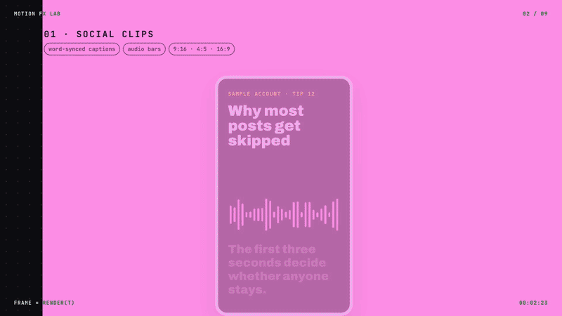

# Motion FX Lab

**Motion graphics as plain web pages, rendered to MP4 you can trust.** 36 ready-made effects in HTML, CSS, SVG, Canvas and three.js, and a recorder that renders any timeline page 7.5× faster than a default headless browser while rendering every frame twice and comparing the two before it gives you a file.

[](media/intro.mp4)

▶ **[Full intro video, with sound](media/intro.mp4)** (35 s, rendered by this repo) · **[Live gallery](https://howardc38.github.io/motion-fx-lab/)** · **Licence: [0BSD](LICENSE)**, no conditions · No build step · No generative AI

GitHub does not play video files from a repository inline, so the loop above is a GIF. The gallery plays the real video.

## Sound familiar?

- **Changing one word means another export.** Your motion graphics live in a desktop app. You cannot diff them, review them in a pull request or render ten variants from a script.
- **Code-to-video frameworks want React, and a licence.** Remotion is built on React, and companies of more than three people need a paid licence. Several other tools have stopped getting updates.
- **Headless Chrome renders your 3D on a CPU.** By default Playwright's headless Chromium runs WebGL on SwiftShader, a software GPU. On our test scene that was 99.8 ms a frame instead of 4.0 ms on the real GPU.
- **Browser capture fails silently.** A lost WebGL context screenshots as a blank frame, with no error. Parallel browsers now and then draw web-font text wrongly for part of a run. A spot check of 8 frames missed that; we only caught it by comparing whole renders.
- **Colours shift in the browser.** Converting screenshots to video with ffmpeg's defaults uses the BT.601 matrix and writes no colour tags, and browsers read untagged HD video as BT.709. Our pink `#ff90e8` played back as `#ff9fe8`.
- **The upload comes out quiet, or gets rejected.** Our first mix measured −21 LUFS, far quieter than the −14 LUFS convention, and used AAC at 160 kbps, over Meta's 128 kbps limit for Reels. ffmpeg's `loudnorm` silently switched to dynamic compression when a linear gain would clip.
- **Chinese, Japanese and Korean text break common effects.** Bundled 3D fonts have no CJK glyphs, and halftone or glitch effects wipe out dense strokes.

## What you get

| Pain | What this repo does |
|---|---|
| Hand-built, un-diffable animation | Every effect is a small function of time in a plain web page. Open `index.html`; no framework, no bundler. |
| Starting from a blank page | 36 effects you can copy: kinetic type, UI mock-ups, charts, particles, shaders, chrome, toon and flat characters. |
| Slow 3D in headless Chrome | GPU rendering through ANGLE Metal, lossless CDP screenshots and 4 browsers in parallel: **399.6 s → 52.9 s** for a 56-second, 3D-heavy video, including the second render that verifies it. |
| Silent wrong frames | The whole video is rendered twice, each frame on a different browser, and every frame is compared. The recorder also stops on a CPU fallback, a lost WebGL context, a page error or a font that did not load. |
| Colour shifts | Screenshots are converted with the BT.709 matrix and every file is tagged BT.709; the checks refuse an untagged file. |
| Quiet or rejected uploads | Audio is limited, then brought to −14 LUFS by a linear gain, and its loudness and true peak are measured on the final file. Video and audio are checked against Meta's Reels limits. |
| CJK text | Particle text is drawn on a canvas and sampled, so it works in any script. Two tiles show which effects not to put on dense Chinese text. |
| Licence worries | Code under 0BSD: use it for anything, no attribution needed. Music and sound effects are synthesised in code, so there is no sample to license. |

## Quick start

```sh
git clone https://github.com/howardc38/motion-fx-lab.git
cd motion-fx-lab
open index.html                         # the gallery; any modern browser works, online
npm install
npx playwright install chromium
bash video/build.sh video/intro.html    # writes media/intro.mp4, intro_hq.mp4, intro.jpg and intro.gif
```

Rendering needs macOS on Apple silicon for the GPU path, plus Node, Python 3 (standard library only) and ffmpeg with libx264. Tested with Node 26.8.1, Python 3.12.10, ffmpeg 8.1.1 and Playwright 1.59.1. Without a Metal GPU, render on SwiftShader with `RECORD_ARGS="--cpu --workers 2" bash video/build.sh video/intro.html`: on the same M4 that took 25.9 s plus 25.8 s to verify, against 9.0 s plus 9.0 s on the GPU with 4 browsers.

The build overwrites the files in `media/`, which are the ones this repo ships.

## Proof

Measured on an Apple M4 laptop on 2026-09-28.

| | |
|---|---|
| 56-second, 1,693-frame promo with heavy 3D, default headless Chromium (one browser, SwiftShader, `page.screenshot`) | 399.6 s |
| The same video, this recorder, 4 browsers, every frame rendered twice and compared | **52.9 s** (again: 51.5 s), of which 17.6 s is the first render and 16.8 s the second |
| Before full verification was added, with an 8-frame spot check instead, 1 / 4 / 6 / 8 browsers | 71.0 / 26.4 / 28.5 / 31.9 s |
| `media/intro.mp4`, 1,045 frames: render, then the verifying second render | 9.0 s + 9.0 s, all 1,045 frames matching |
| Pixels identical between the fast CDP capture and `page.screenshot` | 8 of 8 test frames |
| Intro audio and colour | −14.1 LUFS integrated, −1.8 dBTP true peak, AAC 126 kbps; BT.709, tagged |

The 56-second promo is one of ours and is not in this repo. Beyond 4 browsers there is no gain, because a single ffmpeg process decodes every screenshot and writes the master.

## How it works

An effect never keeps state between frames. It reads `t` and sets what it draws:

```js
demo({ id: "count", period: 3.2, hero: 2.4, /* name, chips, purpose… */
  build(stage) {
    stage.innerHTML = `<div class="cnt-n">HK$<span>0</span></div>`;
    const n = stage.querySelector("span");
    return (t) => { n.textContent = Math.round(12000 * outCubic(lin(0.3, 1.6, t))).toLocaleString("en-US"); };
  } });
```

No `requestAnimationFrame` state, no clock, no unseeded randomness at draw time. That is what lets you scrub to any moment, render a frame again and get the same pixels, and split a video across browsers. Every 3D tile draws on one shared WebGL renderer and copies the result into its own canvas, so the gallery uses a single WebGL context.

```
page.html ─ record.cjs cues ─► cues.json ─► sfx.py + music.py ─► mix.wav ──────────┐
          └ record.cjs video ─► lossless BT.709 master (rendered twice, compared) ──┴─► deliver.py ─► .mp4 · _hq.mp4 · .jpg ─► gif.py ─► .gif
```

`video/build.sh` runs all of it.

## Make your own video

Copy `video/intro.html` and change it. The engine needs:

- `#frame > #stage` with `data-w`, `data-h` and `data-dur` (width, height, seconds).
- `section.scene` children with `data-start` in seconds. A scene wipes in over 0.5 s unless it has `data-trans="cut"`; an optional `.edge` child draws the wipe's edge.
- Elements animated by `data-fx` plus `data-at` (seconds after the scene starts). The names and their extra attributes are listed at the top of `video/engine.js`; an unknown name is an error.
- `data-sfx` for a sound cue, using a name from `LEVEL` in `video/sfx.py`.
- `window.__music = [[seconds, section], …]`, with sections `intro`, `build`, `drop`, `lift`, `break`, `final` and `tail`. Put the drop on a 2.4 s bar line.
- Optionally `window.__gif = [[start, end], …]` for the GIF preview.
- Gallery tiles run inside a scene with `<div class="stage" data-demo="<id>" data-t0="…">`. See the script at the bottom of `video/intro.html`.

Then run `bash video/build.sh video/yours.html`.

## What is inside

| Path | What it is |
|---|---|
| `index.html` | The gallery: every effect running live, with filters, the stack table and render measurements |
| `fx/demos.js`, `fx/demos.css` | The effects, each `build(stage)` returning `frame(t, abs)`, and their styles |
| `fx/font-helvetiker-subset.js` | 14 glyphs of Helvetiker Bold for the extruded 3D text |
| `video/engine.js` | Timeline engine: scenes, 30-odd `data-fx` animations, wipes, the sound-cue list |
| `video/record.cjs` | Renders a page to a verified, BT.709 lossless master on the GPU, in parallel |
| `video/sfx.py`, `video/music.py` | Sound effects and music synthesised from oscillators and noise |
| `video/deliver.py` | Loudness mastering and the final MP4 files, each checked before it is delivered |
| `video/gif.py` | The GIF preview, cut from the clips the page declares |
| `video/intro.html` | The source of the intro video |
| `video/build.sh` | The whole pipeline in one command |

## The effects

34 effects in the gallery, plus two redesigns of a code-drawn mascot. Each tile says how it is drawn and gives a grade: **A** needs nothing beyond this stack, **A+** loads one more three.js add-on file, **B** is a custom shader.

- **Type and layout:** whip-in letters with motion blur, character pops, a 3-second headline hook, word-synced captions, typewriter, highlighter, counting numbers, sticker labels.
- **UI and diagrams:** light sweep, frosted glass, a camera move over a UI card, blueprint callouts on a dot grid, a self-drawing flow chart, a 24-hour countdown ring, scan-and-check chips.
- **3D and shaders (three.js r128):** lit 3D type with soft shadows, rays with bloom, fbm smoke, particles that assemble into words, a noise dissolve patched into a lit material, chrome with a painted environment map, a line tunnel, liquid-glass refraction.
- **Characters:** a halftone mascot built from primitives, a 3D toon version with outlines, and a flat SVG version with a per-part rig.
- **What not to do:** halftone and RGB-split glitch on dense Chinese text, to show how the strokes disappear.

The tiles were built for short promo videos about an Instagram DM assistant for insurance agents in Hong Kong, which is why the sample text talks about DMs, drafts and savings plans. Swap in your own words.

## It fails closed

A render that cannot be proven correct produces no file:

- WebGL must run on ANGLE Metal, or on SwiftShader when you pass `--cpu`. Backends are never mixed in one run, because they do not produce the same pixels.
- Every WebGL context is checked on every frame.
- A page error, or a font still loading or failed, stops the run.
- Every frame is rendered twice, by two different browsers, and all frames are compared. A frame fails if more than 0.01 % of the samples in its luma or chroma planes differ by more than 8 levels, or more than 20 differ by more than 48. GPU edge noise stays well under both limits; a missing line of text or a frame from the wrong time does not. On a mismatch the recorder exits with code 3, keeps the frames in `video/mismatch/`, and `build.sh` renders again, up to 5 times.
- Both renders must hold every frame. The audio must reach −14 LUFS by a linear gain after limiting, measured on the final file with its true peak. Each file is checked for codec, BT.709 tags, size, frame rate, peak bitrate, an AAC track within 128 kbps, `moov` ahead of `mdat` and no edit list.
- Files are made and checked in a scratch folder and moved into `media/` only when every check has passed.

## Compared with other ways to make the same video

| | This repo | Remotion | HyperFrames | After Effects |
|---|---|---|---|---|
| You write | HTML, CSS, SVG, Canvas, three.js | React components | HTML | Nothing; you animate by hand |
| Licence | 0BSD | Free for individuals and companies of up to 3 people; paid above that | Apache-2.0 | Paid subscription |
| Maturity | New | Mature | v0.8, frame API marked experimental | Mature |

Remotion and HyperFrames checked on 2026-09-28 against their licence files and documentation.

## Known issue

With several browsers rendering in parallel, one of them now and then draws web-font text wrongly for a stretch of a run. In one case an SVG label was laid out at 95 units instead of 158 and not painted at all, while `document.fonts` reported its face as loaded. About half of the intro renders on our machine were rejected this way. The cause is not found. Ruled out so far: waiting for fonts before each capture, loading every used face by name, CPU rasterisation of page content, re-laying out SVG text before recording, and loading the exact font weight. The two-render comparison means such a render is never delivered, and `build.sh` renders again, up to 5 times. If you know the cause, please open an issue.

## Limits

- The GPU path is verified on macOS only. In our benchmarks, one of 8 parallel SwiftShader browsers lost its WebGL context and returned blank frames without an error, which is why the recorder checks every context on every frame.
- Emoji and a few symbols (✓, ★) are drawn with the operating system's fonts. On macOS these are Apple Color Emoji, Lucida Grande and PingFang, so a render on Linux or Windows looks slightly different.
- three.js is pinned at r128, which still ships the single-file UMD build and `examples/js` (removed in r161 and r148). Upgrading means re-tuning every colour, light and shader.
- The 3D font has no CJK glyphs, so Chinese text stays flat.
- There are no automated tests or CI yet.

## Help wanted

- **The parallel web-font flake above.** With a root cause, the verifying second render could shrink to a spot check, halving render time.
- **A GPU path on Linux**, so renders can run on a server.
- **Tests and CI** for the recorder's checks.
- **More effects**, as long as each one stays a pure function of `t`.

If this saves you an export marathon or a night chasing blank frames, **star the repo**. It tells us people want more of it.

## Licence

[0BSD](LICENSE): use, copy, modify and distribute for any purpose, with or without attribution. The Helvetiker glyph subset keeps its own licence, and three.js and the fonts load from public CDNs under theirs; see [THIRD_PARTY.md](THIRD_PARTY.md).
