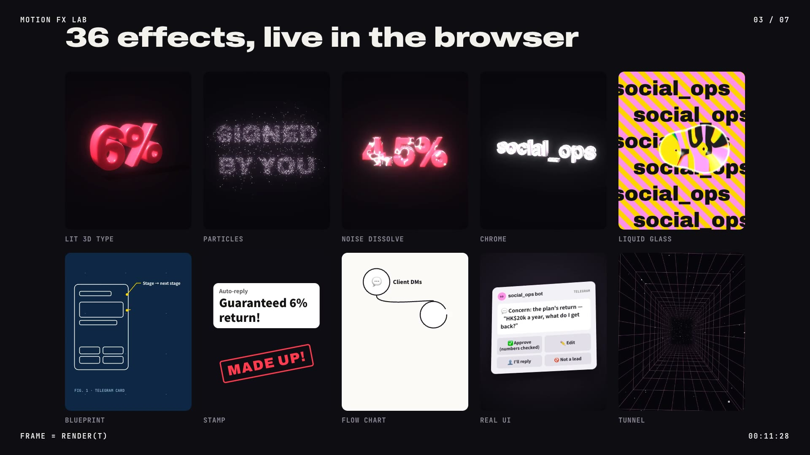

# Motion FX Lab

[](media/intro.mp4)

36 motion-graphics effects drawn live in the browser with plain HTML, CSS, SVG, Canvas and three.js, and a recorder that turns any timeline page into a verified, frame-exact MP4. No generative AI anywhere: the characters are drawn in code and the music is synthesised.

**[Open the live gallery](https://howardc38.github.io/motion-fx-lab/)** · **[Watch the intro video](media/intro.mp4)** (35 s, rendered by this repo) · **Licence: [0BSD](LICENSE)**, use it for anything

## Why it exists

We needed short promo videos for social_ops, an Instagram DM assistant for licensed insurance agents in Hong Kong. Instead of a video editor, every effect is a web page in which each frame is a pure function of time. That means you can scrub to any moment, render any frame again and get the same pixels, and render frames in parallel. The demo text in the tiles comes from those promos.

## What is inside

| Path | What it is |
|---|---|
| `index.html` | The gallery: every effect running live, with filters, a stack table and render measurements |
| `fx/demos.js` | The effects. Each one is `build(stage)`, which returns `frame(t, abs)` |
| `fx/demos.css` | Styles for the effect tiles |
| `fx/font-helvetiker-subset.js` | 14 glyphs of Helvetiker Bold for the extruded 3D text |
| `video/engine.js` | Timeline engine: scenes, 30-odd `data-fx` animations, wipes and the sound-cue list |
| `video/record.cjs` | Renders a page to a lossless master on the GPU, in parallel browsers, and verifies every frame |
| `video/sfx.py`, `video/music.py` | Sound effects and music synthesised from oscillators and noise |
| `video/deliver.py` | Loudness mastering and the final MP4 files, each checked |
| `video/intro.html` | The source of the intro video |
| `video/build.sh` | The whole pipeline in one command |

## The effects

The gallery has 34 effects plus two redesigns of a code-drawn mascot. Each tile shows how it is drawn and a grade: **A** needs nothing beyond this stack, **A+** loads one more three.js add-on file, **B** is a custom shader.

- **Type and layout:** whip-in letters with motion blur, character pops, a 3-second headline hook, word-synced captions, typewriter, highlighter, counting numbers, sticker labels.
- **UI and diagrams:** light sweep, frosted glass, a camera move over a real UI card, blueprint callouts on a dot grid, a self-drawing flow chart, a 24-hour countdown ring, scan-and-check chips.
- **3D and shaders (three.js r128):** lit 3D type with soft shadows, rays with bloom, fbm smoke, particles that assemble into words, a noise dissolve patched into a lit material, chrome with a painted environment map, a line tunnel, liquid-glass refraction.
- **Characters:** a halftone mascot built from primitives, a 3D toon-shaded version with outlines, and a flat SVG version with a per-part rig.
- **Two things not to do:** halftone and RGB-split glitch on dense Chinese text. Both are there to show how the strokes disappear.

## How a frame is made

An effect never keeps state between frames. It reads `t` and sets what it draws:

```js
demo({ id: "count", period: 3.2, hero: 2.4, /* name, chips, purpose… */
  build(stage) {
    stage.innerHTML = `<div class="cnt-n">HK$<span>0</span></div>`;
    const n = stage.querySelector("span");
    return (t) => { n.textContent = Math.round(12000 * outCubic(lin(0.3, 1.6, t))).toLocaleString("en-US"); };
  } });
```

There is no `requestAnimationFrame` state, no clock and no unseeded randomness at draw time. Every 3D tile draws on one shared WebGL renderer and copies the result into its own canvas, so the gallery needs only one WebGL context. Text in any script becomes particles by drawing it on a canvas and sampling the pixels, because the 3D font has no CJK glyphs.

A video page is a `#stage` of `.scene[data-start]` sections. Elements animate through attributes such as `data-fx="pop" data-at="0.4"`, and `data-sfx` adds a sound cue. The page can host gallery tiles and runs them on the video's clock; see `video/intro.html`. The engine exposes `window.__render(t)`, which the recorder calls for each frame.

## Render a video

You need macOS on Apple silicon for GPU rendering, Node, Python 3 (standard library only) and ffmpeg with libx264. Tested with Node 26.8.1, Python 3.12.10, ffmpeg 8.1.1 and Playwright 1.59.1.

```sh
npm install
npx playwright install chromium
bash video/build.sh intro.html   # writes media/intro.mp4, media/intro_hq.mp4 and media/intro.jpg
```

`build.sh` exports the sound cues and music sections from the page, synthesises the effects and the music, renders the video twice and compares every frame, mixes the audio, and writes the files. To look at the gallery, open `index.html` in a browser.

## Measured

On an Apple M4 laptop, on 2026-09-28:

| | Time |
|---|---|
| A 56-second, 1,693-frame promo with heavy 3D (not in this repo), old pipeline: one browser, SwiftShader, `page.screenshot` | 399.6 s |
| The same promo, new pipeline with 4 browsers | 26.4 s (1 browser: 71.0 s; 6: 28.5 s; 8: 31.9 s) |
| `media/intro.mp4`, 1,045 frames: render, then an independent second render for verification | 9.0 s + 9.1 s |

The intro's audio measures −14.0 LUFS integrated with a true peak of −1.3 dBTP. Beyond 4 browsers there is no gain, because one ffmpeg process decodes every PNG and writes the master.

## It fails closed

A render that cannot be proven correct produces no file:

- WebGL must run on ANGLE Metal, or on SwiftShader when you pass `--cpu`. Backends are never mixed in one run, because they do not produce the same pixels.
- Every WebGL context is checked on every frame. A lost context screenshots as a blank frame with no error.
- A page error, or a font still loading or failed, stops the run.
- Every frame is rendered twice, each time by a different browser, and all frames are compared. A frame fails if more than 0.01 % of its pixels differ by more than 8 levels, or more than 20 pixels differ by more than 48. GPU edge noise stays well under both limits; a missing line of text or a frame from the wrong time does not.
- The master must hold every frame. The audio must reach −14 LUFS by a linear gain, and loudness and true peak are measured on the final file. The files are checked for codec, size, frame rate, peak bitrate, an AAC track within 128 kbps, `moov` ahead of `mdat` and no edit list.

## Known issue

With several browsers rendering in parallel, one of them now and then draws web-font text wrongly for a stretch of a run. In one case we caught an SVG label laid out at 95 units instead of 158 and not painted at all, while `document.fonts` reported its face as loaded. About half of the intro renders on our machine were rejected this way. We have not found the cause. Ruled out so far: waiting for fonts before each capture, loading every used face by name, CPU rasterisation of page content, re-laying out SVG text before recording, and loading the exact font weight. Because of the two-render comparison, such a render is never delivered, and `build.sh` tries up to three times. If you know the cause, please open an issue.

## Limits

- The GPU path is verified on macOS only. Elsewhere use `--cpu` (SwiftShader), which is several times slower. In our benchmarks, one of 8 parallel SwiftShader browsers lost its WebGL context and returned blank frames without an error, which is why the recorder checks every context on every frame.
- three.js is pinned at r128, which still ships the single-file UMD build and `examples/js` (removed in r161 and r148). Upgrading means re-tuning every colour, light and shader.
- The 3D font has no CJK glyphs, so Chinese text stays flat.

## Licence

[0BSD](LICENSE): use, copy, modify and distribute for any purpose, with or without attribution. The Helvetiker glyph subset keeps its own licence, and three.js and the fonts load from public CDNs under theirs; see [THIRD_PARTY.md](THIRD_PARTY.md).
